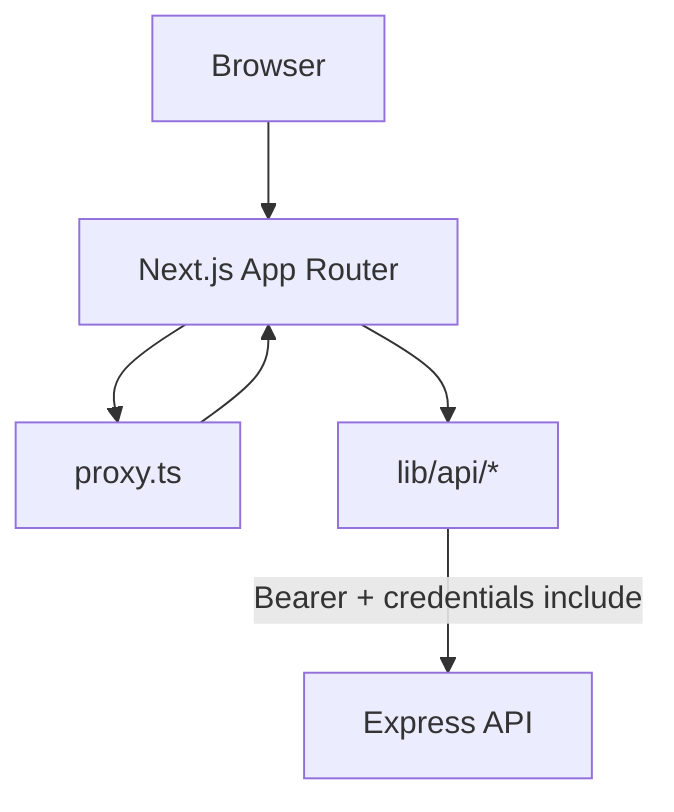

# Frontend Architecture

**Last verified:** June 30, 2026

Architecture guide for **research-pipeline-web** (Next.js 16). The backend is a separate Express + MySQL API reached via `lib/api/` wrappers.

---

## Tech stack

| Layer | Technology |
|-------|------------|
| Framework | Next.js 16 (App Router) |
| Language | TypeScript |
| Styling | Tailwind CSS |
| Auth | JWT session via `session_token` cookie + `Authorization: Bearer` |
| API | Express backend at `NEXT_PUBLIC_API_URL` (default `http://localhost:4000/api`) |

---

## Role hierarchy

| Role | Dashboard prefix | Scope |
|------|------------------|-------|
| `student` | `/student` | Own projects, papers, events |
| `adviser` | `/adviser` | Advisees, reviews, meetings, rubrics |
| `coordinator` | `/coordinator` | Institution courses, defenses, events |
| `admin` | `/admin` | Platform institutions, users, audit |

Role normalization: [lib/auth/roleAccess.ts](../lib/auth/roleAccess.ts). The API maps `teacher` → `adviser`.

---

## Request flow



1. User logs in via the API; the app stores a JWT as `session_token`.
2. [lib/api/client.ts](../lib/api/client.ts) sends `Authorization: Bearer <token>` on every request.
3. [proxy.ts](../proxy.ts) protects dashboard paths and validates the session against `GET /api/auth/me`.

Protected prefixes: `/student`, `/adviser`, `/coordinator`, `/admin`, `/onboarding`, `/help`, `/defenses`.

---

## Route structure

| Group | Path | Purpose |
|-------|------|---------|
| Public | `/`, `/login`, `/register` | Landing and auth |
| Dashboard | `/student/*`, `/adviser/*`, `/coordinator/*`, `/admin/*` | Role pages |
| Shared | `/defenses/*`, `/help`, `/onboarding` | Cross-role features |

Pages live under [app/(dashboard)/](../app/(dashboard)/).

---

## Conventions

- **API calls:** All backend communication through [lib/api/](../lib/api/). No raw `fetch()` in components.
- **UI:** Primitives in `components/ui/`; features in `components/`.
- **Client components:** `'use client'` only when needed.
- **Styling:** Tailwind + tokens in [DOCS/Notes/DESIGN.md](./Notes/DESIGN.md).

---

## API wrapper map

| Domain | Wrapper |
|--------|---------|
| Auth / client | [lib/api/client.ts](../lib/api/client.ts), [lib/api/auth.ts](../lib/api/auth.ts) |
| Projects | [lib/api/projects.ts](../lib/api/projects.ts) |
| Paper versions | [lib/api/paperVersions.ts](../lib/api/paperVersions.ts) |
| Paper comments | [lib/api/paperComments.ts](../lib/api/paperComments.ts) |
| Defenses / recordings | [lib/api/defenses.ts](../lib/api/defenses.ts), [recordings.ts](../lib/api/recordings.ts) |
| Coordinator | [lib/api/coordinator.ts](../lib/api/coordinator.ts) |
| Admin | [lib/api/admin.ts](../lib/api/admin.ts) |
| Users / profile | [lib/api/users.ts](../lib/api/users.ts) |
| Notifications | [lib/api/notifications.ts](../lib/api/notifications.ts) |

Full endpoint list lives in the **API repo** (`docs/API_REFERENCE.md`).

---

## Local setup

```bash
npm install
```

`.env.local`:

```env
NEXT_PUBLIC_API_URL=http://localhost:4000/api
```

```bash
npm run dev
```

App runs on **http://localhost:3000**. The API must be running separately on port 4000.
